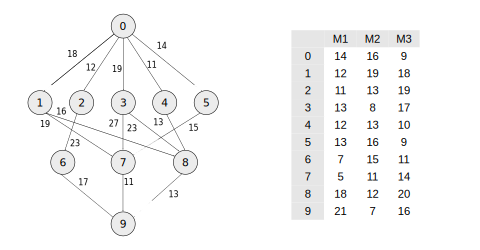

.. _configuration:

=============
Configuration
=============

Running algorithms from the *shadow* library requires two important
configuration files: 

    * The Workflow specification
    * The Environment specification

These are both defined in JSON files, which are described in more detail below. 

Workflow Specification
----------------------
.. code-block:: javascript

    {
        "nodes": [
            {
                "comp": 119000,
                "id": 0
            },
            {
                "comp": 92000,
                "id": 1
            },
            {
                "comp": 95000,
                "id": 2
            },
            ....
            ....
        ],
        "links": [
            {
                "data_size": 18,
                "source": 0,
                "target": 1
            },
            {
                "data_size": 12,
                "source": 0,
                "target": 2
            },
            {
                "data_size": 9,
                "source": 0,
                "target": 3
            }, 
            ...
            ...
    }          

The environment the in which the workflow is scheduled is defined in a
separate file; this way, scheduling across different environment
configurations can be tested (additionally, it is likely workflows will
change, whereas workflows will be run in different environments all the time).

.. code-block:: javascript

    {
      "system": {
        "resources": {
          "cat0_m0": {
            "flops": 7.0
          },
          "cat1_m1": {
            "flops": 6.0
          },
          "cat2_m2": {
            "flops": 11.0
          }
        },
        "rates": {
          "cat0": 1.0,
          "cat1": 1.0,
          "cat2": 1.0
        }
      }
    }

For large systems, with many resources of the same type, the following is
common: 

.. code-block:: javascript

        "resources": {
          "cat0_m0": {
            "flops": 145.0
          },
          "cat0_m1": {
            "flops": 145.0
          },
          "cat0_m2": {
            "flops": 145.0
          },
          "cat0_m3": {
            "flops": 145.0
          },
        }

As mentioned earlier, it is also possible to use pre-calculated costs (i.e.
completion time in seconds) when
scheduling with *shadow*. This approach is less flexible for
scheduling workflows, but is a common approach used in the scheduling
algorithm literature. This can be achieved by adding a list of costs per tasks
to the workflow specification JSON file, in addition to the following 'header': 

Here, we present an example schedule for the DAG presented in the original
HEFT paper.

.. code-block:: javascript

    {
        "header" : {
        "time": true
        },
        ...

        "nodes": [
        {
            "comp": [
                14,
                16,
                9
            ],
            "id": 0
        },
        ...
    }
