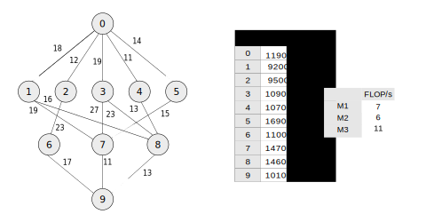

Example schedule
================

*shadow* is Workflow-oriented, which means
most of the work done within the library involves passing around workflow
objects, or storing data within the object itself. 

This workflows are represented as Directed Acyclic Graphs (DAGs), and the
a solution to the DAG scheduling problem is the scheduling order and machine
allocation of tasks (the nodes) from the DAG. 

In *shadow*, we use JSON to store our workflows, which are always represented
as DAGs. This JSON data is read into a *shadow* as a NetworkX ``DiGraph``
object, and then wrapped in *shadow*'s ``Workflow`` class. The ``Workflow``
class accepts two types of graph specifications; one that has pre-calculated
costs, and one without. The preferred approach is to present task with 'total
computation cost'; the units may be application specific, but when coupled
with machine resources they should be easily converted to time (it is easiest
to think of them in terms of required cycles or Total FLOP). 

For exampe, below is a small workflow, depicted as a graph, with the total
computation costs and machine values stored in the table to the right. The
workflow is based on the example presented in the HEFT paper [1]_. 

   

The computation costs for tasks, along with the graph attributes, are stored
in a JSON file separate to the machine specifications. In *shadow*, We first
initialise a ``Workflow`` object, and then add an environment to it; this
environment is constructed from our machine specification. The
structure of the specification files are described in more detail in
':ref:`configuration`'. 

	
.. code-block:: python 

	from shadow.classes.workflow import Workflow
	from shadow.classes.environment import Environment

	wf = Workflow('example_graph.json')
	env = Environment('machine_spec.json')
	wf.add(env)

To run an algorithm on the workflow and determine the final makespan, simply
pass the Workflow object to the algorithm: 

.. code-block:: python

	from shadow.heuristics import heft

	heft(wf)
	print(wf.makespan) # 98

.. [1] `Performance-effective and low-complexity task scheduling for heterogeneous computing (Topcuoglu et al. 2002) <https://ieeexplore.ieee.org/document/993206>`_.
